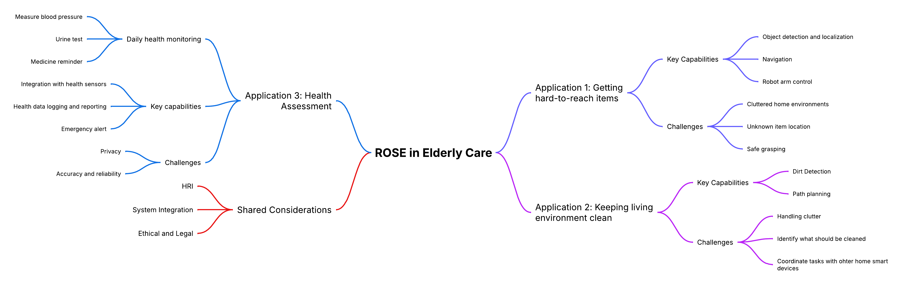
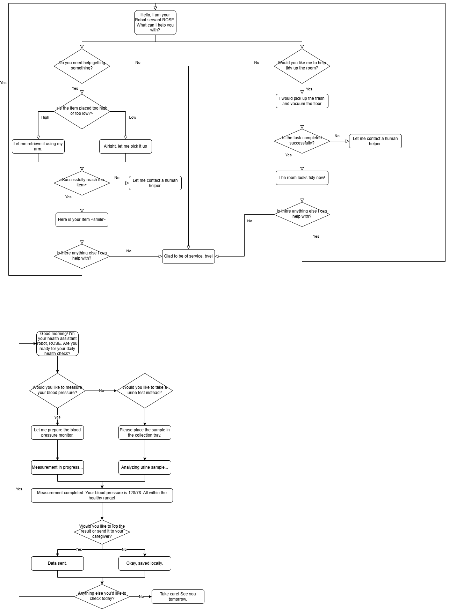

# Social Robot Design Portfolio

---

## About Me
| Member | Brief Introduction | Personal Page |
| :----: | :-----------------: | :-----------: |
| Yuqing Liu | Passionate MSc student specializing in robotics, with a strong background in mechatronics and robotic systems. Skilled in kinematics, robot control, embedded systems, and computer vision. Currently exploring machine perception, autonomous navigation, and reinforcement learning.| [See CV.md] |

---

## Group Work

### Case Description
ROSE (Robot Operating System Environment) is a social robot development platform based on ROS, often using the TIAGo robot manufactured by PAL Robotics as its hardware foundation. TIAGo is a multifunctional robot that integrates a mobile base, robotic arm, elevating torso, and a variety of sensors (such as lidar, RGB-D cameras, etc.), and is widely used in research, education, and human-robot interaction fields. 

#### Existed Functions and Scenario Analysis
##### Stories/narratives in media and project data & Currently developed scenarios
Narratives/themes identified: 

(1) Intentional vs Unintentional Obstruction: A recurring narrative involves distinguishing between human behaviors that are socially intentional (e.g., trying to engage with the robot) vs unintentional (e.g., unaware obstruction).

(2) Navigation in constrained environments: Especially in healthcare settings like hospital corridors, robots face complex human-robot interaction scenarios.

(3) Social cues as interaction triggers: Stories often revolve around the robot interpreting gaze, movement hesitation, and posture as signals of human intent

Application Scenarios

(1) Logistics: ROSE delivering samples or items in hospital environments while interacting with or avoiding people.

(2) Companionship/personal assistance: Visitors engaging intentionally with the robot out of curiosity or for help.

(3) Health/nutrition advice: Potential future use cases hinted through the broader categories in the tool list.
#### Our case
Our case is to apply the ROSE robot in elderly care to accomplish three applications. These three applications are respectively: helping the elderly obtain things that are difficult to get; Keep the living environment clean and tidy. And also assist the elderly in conducting self-assessment of their own health status: such as measuring blood pressure every morning, conducting urine tests, and other behaviors.

---

### Selection of Useful Design Tools

  
#### Senario Analysis
References:

(1) Through the dual-track deduction of the best scenario and the worst scenario, break through the linear prediction model, and systematically simulate the development paths of positive and negative extremes that deviate from the long-term trend; (2) Based on the dynamic correlation analysis between key influencing factors and the goals, guide participants to independently develop differentiated future scenarios and form strategic predictions covering the possibility spectrum; (3) Taking the preset scenarios as the creative anchor points, drive participants to transform abstract variables into specific action strategies, achieving decision support from risk contingency plans to opportunity capture. This method effectively balances the rigor and innovative tension of strategic planning by structuring the imaginative space. [Busse T, Kernebeck S, Nef L, Rebacz P, Kickbusch I, Ehlers J
Views on Using Social Robots in Professional Caregiving: Content Analysis of a Scenario Method Workshop
J Med Internet Res 2021;23(11):e20046](https://www.jmir.org/2021/11/e20046/)

#### Story Boarding
References:

Through a case of medical caring team with patients, doctors and robots, we are informed that: Through the visual narrative framework, the multiple perspectives of caregivers, patients and medical staff are integrated to transform abstract needs into concrete scenarios (such as daily auxiliary scenarios), revealing the potential paths of technological intervention. The core significance lies in breaking through the limitations of traditional demand research, using co-created storyboards to stimulate participants' imagination of robot application scenarios, simultaneously capturing functional requirements and humanistic care demands, providing a decision-making basis that takes into account both practicality and emotional adaptability for technical design, and ultimately achieving a precise connection between technological innovation and real user needs. [B. Sienkiewicz, Z. Radosz-Knawa and B. Indurkhya, "A participatory design approach to using social robots for elderly care*," 2024 IEEE International Conference on Advanced Robotics and Its Social Impacts (ARSO), Hong Kong, 2024, pp. 194-199, doi: 10.1109/ARSO60199.2024.10557812.](https://ieeexplore.ieee.org/abstract/document/10557812)

#### Wizard of Oz
References:

Wizard of Oz, through the design of restricted perception experiments, simulates the perception and behavioral limitations in the real interaction scenarios of robots, enabling human experts (" guides ") to dynamically generate interaction strategies based only on the limited information available to robots. By limiting the perception range of the guide (aligning with the sensor capabilities of the robot), the non-portability of the strategy caused by the "omniscient perspective" of human experts in traditional methods is avoided, and the adaptability of the strategy to the actual capabilities of the robot is improved. The interaction behavior data collected under restricted conditions can be directly transformed into the autonomous control logic of the robot, reducing the "reality gap" in the subsequent algorithm development. [P. Sequeira et al., "Discovering social interaction strategies for robots from restricted-perception Wizard-of-Oz studies," 2016 11th ACM/IEEE International Conference on Human-Robot Interaction (HRI), Christchurch, New Zealand, 2016, pp. 197-204, doi: 10.1109/HRI.2016.7451752.](https://ieeexplore.ieee.org/abstract/document/7451752)

#### Lego Series

---

### Senarios

For the interaction between users and robots to be appropriate and sustainable, it is necessary to reduce the influence of uncertainty and negative emotions. Therefore, in addition to the robot's own understanding ability of semantics, it is also necessary to consider different scenarios where users have varying levels of trust in the robot.
[Miller Linda , Kraus Johannes , Babel Franziska , Baumann Martin, "More Than a Feeling—Interrelation of Trust Layers in Human-Robot Interaction and the Role of User Dispositions and State Anxiety," 2021 Vol12 Frontiers in Psychology, doi:10.3389/fpsyg.2021.592711](https://www.frontiersin.org/journals/psychology/articles/10.3389/fpsyg.2021.592711
)
#### Low user trust/low robot understanding:
70-year-old Bob was influenced by science fiction movies and believed that robots were villains who would rule the earth, so he did not trust and was afraid of robots.
Bob felt uncomfortable in his heart and sat on the sofa, holding his chest and breathing, but did not speak. The robot could not recognize the meaning of Bob's subtle movements and thought that Bob was dancing, and began to ask Bob if he needed to play music to accompany him.
Bob said sarcastically, "You are so smart", and the robot responded, "Thank you for the compliment, I will continue to work hard"

Problems with this scenario response:
The robot lacks "micro-movement" and "micro-expression" recognition, cannot understand the intention represented by human movements, lacks a model for emotional context analysis, and cannot recognize the emotions expressed by humans through voice intonation.

#### High user trust/low robot understanding:
One early morning, Grandma Zhang, as usual, used the ROSE robot for a health checkup. She voluntarily put the blood pressure monitor on her arm and said, "Little R (the robot's nickname), measure my blood pressure for me." The robot detected Grandma Zhang's action of holding the blood pressure monitor through the camera but mistakenly confused it with her daily action of "holding a water cup" (Note: The blood pressure monitor and water cup have similar shapes), and thus responded, "Sure, I'm pouring water for you." It then moved its mechanical arm to try to take the blood pressure monitor. 
Grandma Zhang was taken aback for a moment and explained with a smile, "It's not a water cup, it's for measuring blood pressure!" The robot received the keyword "blood pressure" and triggered the preset process, but failed to correctly associate it with the current situation (the arm was already wearing a blood pressure monitor). Instead, it broadcasted the blood pressure history data from last week: "Your average blood pressure last week was 125/80 mmHg." Meanwhile, the mechanical arm was still trying to grasp the blood pressure monitor, causing it to fall off. 
Grandma Zhang wasn't angry. Instead, she patiently repeated, "Little R, you haven't measured it today. You need to measure the new one first." The robot recognized the keyword "measure" again and started the default "environmental detection" mode. It scanned the room with a laser radar and reported, "The current room temperature is 26 degrees Celsius and the air quality is good." Grandma Zhang shook her head helplessly and measured her blood pressure manually. She comforted the robot, "It's okay. Try again tomorrow. You'll get it after a few more times."

Problems with this scenario response:
Weak object detail recognition: Unable to distinguish the binding strap/texture features of a blood pressure monitor from those of a water cup. 
Task chain disruption: Isolated response to the keyword "blood pressure", ignoring the coherent logic of "wearing the device - measurement - recording". 
Trust backfires: Users' excessive tolerance of errors delays the timeliness of health monitoring.

#### Low user trust/high robot understanding:
68-year-old Mary has a stubborn personality and is strongly resistant to new technology. Her daughter, who lives in another city, bought her a new type of care robot and persuaded her to use it. Mary reluctantly used the robot to monitor her daily health data, to make her daughter feel at ease.
One night, because the robot had failed to charge successfully during the day, it moved to the charging station by itself at night to try charging again. Since Mary never cared about the robot’s charging behavior, she was frightened by the moving figure in the living room when she got up at night, and fainted for a short time.
Although the robot detected the problem and called her daughter and the nearby medical center in time, and the result showed that Mary’s body was fine, she still refused to keep the robot at home again.

Problems with this scenario response: The robot can rocognize people’s emotion and other data and try to offer help. But users’trust to the robot are so low that even they share the same goal, the users still cannot accept the robot’s help as a daily routine.
---

### Overview Design

### Mindmap of Problem Space

### Potential Building Blocks
#### Perception and Sensing
- Camera
- Lidar
- Microphone/Speaker
- Medical Sensors
#### Robot Mobility & Manipulation
- Arm Manipulation
- Mobile Control
#### Human-Robot Interaction
- NLP
- Touchscreen interface
#### Alert System
#### System integration

### Functional Breakdown
#### Assist in Retrieving Objects
- Environment Perception and Object detection
- Understand Human Commands
- Navigation
- Manipulate and Retrieve object
- Deliver Object to Elderly

#### Maintain clean and tidy environment
- Detect Mess / Dirt / Items Out of Place
- Plan Cleaning or Tidy Task
- Simple Manipulations
- Navigation

#### Support Daily Health Self-Assessment
- Prompt and Guide Elderly
- Integrate with Medical Devices
- Record and Analyze Results
- Communicate with Caregiver if Needed

### Potential Experimental approach
#### Verify that robot can complete tasks autonomously
#### Evaluate naturalness, trust, and ease of use
#### Observe learning curve and routine integration

| Aspect                | Metric/Tool                            |
| --------------------- | -------------------------------------- |
| Task performance      | Task success rate, time, failure modes |
| HRI usability         | SUS, NASA TLX, interaction steps       |
| Trust & acceptance    | Almere Model Questionnaire             |
| Speech recognition    | Command success rate, retry frequency  |
| Grasping accuracy     | Grasp success rate, misplacement rate  |
| System robustness     | Downtime, recovery from error          |
| Data privacy handling | Consent protocol, encryption logs      |

### Pitch / Slide

---
### Selection of Useful Design Tools

#### Senario Analysis
References:

(1) Through the dual-track deduction of the best scenario and the worst scenario, break through the linear prediction model, and systematically simulate the development paths of positive and negative extremes that deviate from the long-term trend; (2) Based on the dynamic correlation analysis between key influencing factors and the goals, guide participants to independently develop differentiated future scenarios and form strategic predictions covering the possibility spectrum; (3) Taking the preset scenarios as the creative anchor points, drive participants to transform abstract variables into specific action strategies, achieving decision support from risk contingency plans to opportunity capture. This method effectively balances the rigor and innovative tension of strategic planning by structuring the imaginative space. [Busse T, Kernebeck S, Nef L, Rebacz P, Kickbusch I, Ehlers J
Views on Using Social Robots in Professional Caregiving: Content Analysis of a Scenario Method Workshop
J Med Internet Res 2021;23(11):e20046](https://www.jmir.org/2021/11/e20046/)

#### Story Boarding
References:

Through a case of medical caring team with patients, doctors and robots, we are informed that: Through the visual narrative framework, the multiple perspectives of caregivers, patients and medical staff are integrated to transform abstract needs into concrete scenarios (such as daily auxiliary scenarios), revealing the potential paths of technological intervention. The core significance lies in breaking through the limitations of traditional demand research, using co-created storyboards to stimulate participants' imagination of robot application scenarios, simultaneously capturing functional requirements and humanistic care demands, providing a decision-making basis that takes into account both practicality and emotional adaptability for technical design, and ultimately achieving a precise connection between technological innovation and real user needs. [B. Sienkiewicz, Z. Radosz-Knawa and B. Indurkhya, "A participatory design approach to using social robots for elderly care*," 2024 IEEE International Conference on Advanced Robotics and Its Social Impacts (ARSO), Hong Kong, 2024, pp. 194-199, doi: 10.1109/ARSO60199.2024.10557812.](https://ieeexplore.ieee.org/abstract/document/10557812)

#### Wizard of Oz
References:

Wizard of Oz, through the design of restricted perception experiments, simulates the perception and behavioral limitations in the real interaction scenarios of robots, enabling human experts (" guides ") to dynamically generate interaction strategies based only on the limited information available to robots. By limiting the perception range of the guide (aligning with the sensor capabilities of the robot), the non-portability of the strategy caused by the "omniscient perspective" of human experts in traditional methods is avoided, and the adaptability of the strategy to the actual capabilities of the robot is improved. The interaction behavior data collected under restricted conditions can be directly transformed into the autonomous control logic of the robot, reducing the "reality gap" in the subsequent algorithm development. [P. Sequeira et al., "Discovering social interaction strategies for robots from restricted-perception Wizard-of-Oz studies," 2016 11th ACM/IEEE International Conference on Human-Robot Interaction (HRI), Christchurch, New Zealand, 2016, pp. 197-204, doi: 10.1109/HRI.2016.7451752.](https://ieeexplore.ieee.org/abstract/document/7451752)

---

### Scenarios 

For the interaction between users and robots to be appropriate and sustainable, it is necessary to reduce the influence of uncertainty and negative emotions. Therefore, in addition to the robot's own understanding ability of semantics, it is also necessary to consider different scenarios where users have varying levels of trust in the robot.
[Miller Linda , Kraus Johannes , Babel Franziska , Baumann Martin, "More Than a Feeling—Interrelation of Trust Layers in Human-Robot Interaction and the Role of User Dispositions and State Anxiety," 2021 Vol12 Frontiers in Psychology, doi:10.3389/fpsyg.2021.592711](https://www.frontiersin.org/journals/psychology/articles/10.3389/fpsyg.2021.592711
)
#### Low user trust/low robot understanding:
70-year-old Bob was influenced by science fiction movies and believed that robots were villains who would rule the earth, so he did not trust and was afraid of robots.
Bob felt uncomfortable in his heart and sat on the sofa, holding his chest and breathing, but did not speak. The robot could not recognize the meaning of Bob's subtle movements and thought that Bob was dancing, and began to ask Bob if he needed to play music to accompany him.
Bob said sarcastically, "You are so smart", and the robot responded, "Thank you for the compliment, I will continue to work hard"

Problems with this scenario response:
The robot lacks "micro-movement" and "micro-expression" recognition, cannot understand the intention represented by human movements, lacks a model for emotional context analysis, and cannot recognize the emotions expressed by humans through voice intonation.

#### High user trust/low robot understanding:
One early morning, Grandma Zhang, as usual, used the ROSE robot for a health checkup. She voluntarily put the blood pressure monitor on her arm and said, "Little R (the robot's nickname), measure my blood pressure for me." The robot detected Grandma Zhang's action of holding the blood pressure monitor through the camera but mistakenly confused it with her daily action of "holding a water cup" (Note: The blood pressure monitor and water cup have similar shapes), and thus responded, "Sure, I'm pouring water for you." It then moved its mechanical arm to try to take the blood pressure monitor. 
Grandma Zhang was taken aback for a moment and explained with a smile, "It's not a water cup, it's for measuring blood pressure!" The robot received the keyword "blood pressure" and triggered the preset process, but failed to correctly associate it with the current situation (the arm was already wearing a blood pressure monitor). Instead, it broadcasted the blood pressure history data from last week: "Your average blood pressure last week was 125/80 mmHg." Meanwhile, the mechanical arm was still trying to grasp the blood pressure monitor, causing it to fall off. 
Grandma Zhang wasn't angry. Instead, she patiently repeated, "Little R, you haven't measured it today. You need to measure the new one first." The robot recognized the keyword "measure" again and started the default "environmental detection" mode. It scanned the room with a laser radar and reported, "The current room temperature is 26 degrees Celsius and the air quality is good." Grandma Zhang shook her head helplessly and measured her blood pressure manually. She comforted the robot, "It's okay. Try again tomorrow. You'll get it after a few more times."

Problems with this scenario response:
Weak object detail recognition: Unable to distinguish the binding strap/texture features of a blood pressure monitor from those of a water cup. 
Task chain disruption: Isolated response to the keyword "blood pressure", ignoring the coherent logic of "wearing the device - measurement - recording". 
Trust backfires: Users' excessive tolerance of errors delays the timeliness of health monitoring.

#### Low user trust/high robot understanding:
68-year-old Mary has a stubborn personality and is strongly resistant to new technology. Her daughter, who lives in another city, bought her a new type of care robot and persuaded her to use it. Mary reluctantly used the robot to monitor her daily health data, to make her daughter feel at ease.
One night, because the robot had failed to charge successfully during the day, it moved to the charging station by itself at night to try charging again. Since Mary never cared about the robot’s charging behavior, she was frightened by the moving figure in the living room when she got up at night, and fainted for a short time.
Although the robot detected the problem and called her daughter and the nearby medical center in time, and the result showed that Mary’s body was fine, she still refused to keep the robot at home again.

Problems with this scenario response: The robot can rocognize people’s emotion and other data and try to offer help. But users’trust to the robot are so low that even they share the same goal, the users still cannot accept the robot’s help as a daily routine.

---
### Expressiveness
observation of paper-puppeteering：

observation recording: https://youtu.be/jthQCp5BSxM

01
Action description: Swing left and right at a constant speed, then jump for 5 seconds and then jump in place at a very fast speed
Guess: excited

02
Action description: Hit the ground with the head at a constant speed and then swing left and right at a constant speed
Guess: The robot wants to express its needs

03
Action description: Quickly retreat in place
Guess: The robot wants to walk with me

04
Action description: The body leans to the right and maintains this action
Guess: Thinking

05
Action description: Sprint forward at a very fast speed
Guess: The emotion is hate

06
Action description: The whole body flips over, imitating a human lying on the ground, or slowly lowering the head
Guess: Sad emotion

LED:

1. Emotional expression and feedback: Express emotions by controlling the combined shape, color and flashing frequency of LED.
Application:
Blue eyes + slow flashing + smiling shape or circle - Indicates that the robot is in a calm state (no task mode), and slow blinking indicates friendly attention to humans and is ready to communicate with humans at any time
Red eyes + rapid flashing + triangle shape - When the robot detects danger and issues a warning, the eyes turn red and flash quickly to attract the user's attention

2. Health monitoring and reminders: Use LED eye changes to remind the elderly of daily health matters, such as taking medicine, drinking water, resting, etc.
Application:
Green eyes - Indicates that the elderly are in good health. When the elderly complete their daily walking goals or take medicine on time, the green eyes flash slowly to encourage
Red eyes - For example, when the elderly miss medication or bedtime, the eyes turn red and flash quickly (slower than when prompting danger signals to distinguish)

#### A tool* for expressiveness
EMO-CUE is a multimodal, low-threshold prototype expression toolbox, consisting of the following components:

##### Expressive Cue Cards

Each card represents an emotion/intention state (such as "I'm listening to you", "I need help", "I'm worried about you"), and the back of the card gives suggestions for multimodal expression combinations:

Light color changes (such as red → anxiety, blue → calm, orange → need interaction)

Vibration or tactile feedback (continuous/pulse rhythm)

Small movement patterns (head turn/backward/forward)

Voice intonation fragments (non-semantic "hmm~", "hiss~", etc.)

##### Hardware modules/low-fidelity prototypes

Use programmable Arduino or micro:bit to control small motors (express retreat), RGB lights (express state changes), and buzzers (simulate intonation).

Allow users to quickly combine and test interactive expressions by mapping cards → modules.

##### Improvisational Scenarios

Provide nursing scenario scripts, such as "elderly hesitant to take medicine", "robot notices user falls", "robot prompts relatives to call via video", etc. Participants use the EMO-CUE tool to interpret robot roles with expressive actions without using language.

---

### Design Behavior  
**Function: Helping with hard-to-reach items, cleaning, and health self-assessment**

---

####  Scenario 1: Helping Reach High or Low Items

**Dialogue**  
> "Yes, it's on the top shelf," said the elderly person.  
> The robot extended its arm, looked up to the cabinet, grasped the item carefully, and handed it to the user with a smile.

**Involved Technologies**  
- `Speech recognition`  
- `LLM + context understanding`  
- `Visual input & scene understanding`  
- `Object localisation`  
- `Vision-based grasping & manipulation`  
- `Motion planning`  
- `Human-robot interaction & gesture coordination`  
- `Affective computing (smile, polite gesture)`

---

####  Scenario 2: Keeping the Environment Clean

**Dialogue**  
> "The floor seems dusty today," the resident commented.  
> The robot activated its vacuum module, scanned the room, navigated around the furniture, and started cleaning.  
> "Done! The room is clean now," it announced.

**Involved Technologies**  
- `Speech recognition`  
- `LLM (intent understanding)`  
- `SLAM (localisation and mapping)`  
- `Path planning & obstacle avoidance`  
- `Dust detection (semantic segmentation)`  
- `Vacuum actuation control`  
- `Affective feedback (speech & tone modulation)`

---

####  Scenario 3: Measuring Blood Pressure

**Dialogue**  
> "Could you check my blood pressure, please?"  
> The robot retrieved the BP cuff, wrapped it gently around the user’s arm, initiated the measurement, and read the result aloud.

**Involved Technologies**  
- `Speech recognition`  
- `LLM (command understanding)`  
- `Manipulation & touch-sensitive actuation`  
- `Biosensor integration (BP monitor control)`  
- `Real-time data acquisition`  
- `Voice synthesis (result announcement)`  
- `Context tracking (session continuity)`

---

####  Scenario 4: Urine Test Analysis

**Dialogue**  
> "I’ve just placed the sample."  
> The robot detected the container, moved it into the analysis bay, and displayed the result on the screen: "All values normal today."

**Involved Technologies**  
- `Speech recognition & intent parsing`  
- `Object detection & classification`  
- `Grasping & manipulation (careful handling)`  
- `Lab-on-robot analysis module integration`  
- `Visual display & voice feedback`  
- `Context awareness (health logs, timestamping)`

---

####  Scenario 5: Logging and Reporting Results

**Dialogue**  
> "Please send the result to my daughter."  
> The robot encrypted the report and uploaded it securely to the connected caregiver app.

**Involved Technologies**  
- `LLM (command parsing)`  
- `User profile management`  
- `Secure data logging & transmission`  
- `Cloud integration`  
- `Role-aware access control`  
- `Affective computing (respectful tone and privacy handling)`

---

### Sustainability and ethics
Envisioning Cards are a practical design tool developed to translate complex theoretical concepts—especially from Value Sensitive Design (VSD) and Multi-lifespan Design (MLD)—into concrete actions for designers. [Yoo, Daisy and Logler, Nick and Ballard, Stephanie and Friedman, Batya, "Multi-lifespan Envisioning Cards: Journeying from Design Theory to Tools for Action,"2022, Association for Computing Machinery](https://dl.acm.org/doi/pdf/10.1145/3532106.3533495)
By applying the four aspects of the envision card: Changing Hands, Environmental Sustainability, The Long Now, Work of the Future, we can consider the ethical issues of robots and their relationship with people during the design process.

#### Changing Hands
An elderly care robot may become a family heirloom, taking care of the elderly in the family for generations. In this case, users may regard this robot as a member of the family, which means that during the design process, the robot may need to store the process of getting along with the family members, so that it can behave like the elder of the family in the process of taking care of people. At the same time, it needs to be able to transfer memory relatively easily to cope with the replacement. And the hardware is preferably modularized to facilitate the replacement of damaged parts.
If the robot is sold as a second-hand product, it also needs to protect the privacy of the original owner. This requires clearing the behavior mode set locally or encrypting the user account of the server, otherwise the information will be leaked after it is sold second-hand or stolen, threatening the personal safety of the old owner.

#### The Long Now

According to the envision cards "The Long Now", we envision a 50-year old who has interacted with the robot over a lifetime, and will continue to interact with the robot in the next few decades, with a five-year period:
At the age of 50, the robot intervenes in life as a practical tool, but not a core part of life. By the age of 55, the elderly have become accustomed to the company of the robot and begin to rely more on the robot for daily reminders and health monitoring. At the age of 60, the elderly may be highly dependent on the robot both physically and emotionally, and the family also fully trusts the robot to take care of the elderly. At the age of 70, the robot even replaces the elderly's existing interpersonal relationships to some extent, weakening personal autonomy and initiative.
The ethical concern highlighted here is that over-reliance on robots may lead to social isolation over time, weakening the connection between people and human communities.
This long-term change needs to be considered in the design stage to ensure that robots complement rather than replace the care of the elderly, and promote relationships between people rather than isolate people's social relationship.

####Embodiment

---

---

## Reflections

### How is Design Research linked to HRI
Design research optimizes the interaction experience between humans and robots by understanding user needs. Applying design research in HRI can help robots integrate more naturally into the human environment and improve communication efficiency and emotional identification.

### Digital (AI) vs Embodiment
> In class, Edwin brought us several companion little robots, there are small robot on a roller who will make nonverbal noises, desk robot that will wave and talk to you, and one to my best interst, robot cats that have close-to-reality fur, gesture, and can even "purr" like real cats. Among these different forms of social robots, the tension between "digitalization" (AI) and "embodiment"  is particularly evident.

First, small roller robots mainly rely on sound and light effects to interact with people. Their "bodies" are very simplified and play more of a role as sound and signal transmitters, lacking real touch and form. Although these robots can attract attention visually and sound prompts can help create a sense of companionship, it is difficult to form a deep connection with users on an emotional level because their "bodies" cannot convey real pressure, temperature or softness.

In contrast, desktop robots are richer in shape and action design. They can not only wave and nod, but also make simple language similar to intonation, which brings a higher anthropomorphic experience in social interaction. However, their rigid plastic shells and mechanical joints still make people aware of their inanimate nature at all times - when you reach out to touch them, the cold material and mechanical stiffness remind you that this is a machine, not a breathing companion.

The robot cat with simulated fur and "purring" sounds represents a peak attempt at embodied social robots. The realistic touch and sound make people almost forget that it is a programmed product; when you stroke its back, you can feel the subtle resistance of the soft "fur" sliding with your fingers, and after hearing the "purring", you will unconsciously feel the warm attachment to a real pet cat. This highly embodied design allows AI's digital intelligence and physical form to be deeply integrated, ultimately blurring the boundaries between people and objects, making it easier for users to psychologically produce "pseudo-social bias" (social presence), and even treat it as a real social partner.

Through this classroom experience, I realized that if social robots want to go beyond the role of "tools", they must be sufficiently "humanized" and "pseudo-life" in both AI algorithms (digital interaction) and hardware forms (body perception) - not only can they understand and respond, but they must also have a real "touch". If future designs can incorporate tactile feedback, temperature simulation, and even micro-expression changes, then social robots will be more likely to become “emotional partners” in our daily lives rather than just cold machines that make sounds or movements.

### Why is 'HER' (not) a Compelling Argument?
"Her" is a convincing film that shows the possibility of a deep emotional connection between humans and AI. However, the AI in the film has no entity, ignoring the important role of embodiment in establishing emotions, so it also has limitations..

### The Robot Revolution: When?
Just like in the Industrial Revolution, technological innovation and market demand catalyzed each other: once the steam engine was improved and low-cost manufacturing was achieved, it was no longer limited to a certain factory, but was quickly applied to various industries such as textiles, mining, and transportation, bringing a cross-domain leap in productivity. When such a "universal power source" also appears in the field of robotics - for example, when the core natural language interaction, emotional perception, and modular hardware platform mature and reduce costs, it can be transplanted on a large scale to various scenarios such as family companionship, health management, and educational counseling, just like the steam engine, thus forming a positive feedback loop of demand-innovation-cost reduction, and finally triggering the next "robot revolution."

### Reflection: The Dinosaur Hotel
The "dinosaur reception" is not only a show of avant-garde technology and service etiquette, but also exposes the limitations of social robots: they can bring short-term novelty with similar greetings and mechanical movements, but it is difficult to read the subtle emotions of customers, resolve sudden problems or provide real warmth; when guests are tired of the same "roaring welcome" and stiff operation in front of the touch screen, the charm of robots will quickly fade. Henn-na Hotel's attempt reminds us that while pursuing automation and efficiency, we should pay more attention to the emotional resonance and depth of experience in the interaction between people and machines. Otherwise, no matter how dazzling the robot is, it can only be a "moving exhibit" rather than a service provider who can truly replace people's hearts.

### Reflection: Nabaztag
The rise and fall of Nabaztag reveals the lifeblood of social robots: it initially gained popularity with its cute shape and the "novelty" of desktop networking, but because natural language processing and emotional computing were not yet mature at the time, and networking and maintenance costs were high, the robot's interaction remained at the level of preset scripts and it was difficult to continue to provide fresh experiences. As the user's sense of novelty faded and the cost of use became apparent, Nabaztag quickly lost market popularity and eventually went bankrupt. This shows that if social robots want to achieve long-term success, they must focus on true language understanding and emotional resonance - only when they can both "understand" and "respond" to human individual needs and continuously generate new interactive value can they evolve from "toys" to "companions."

### Reflection: CuddleBits
CuddleBits uses the familiar plush ball form as a starting point, greatly lowering the psychological threshold for interaction - with just a light touch, it can intuitively convey emotional states such as "excitement" or "pleasure" through the "breathing" rhythm and slight vibration. What's even more commendable is that the simple coding interface behind it allows developers and beginners to easily adjust the parameters of the emotional model: modifying a few lines of code can change the activity or happiness of the "ball". The open source hardware design and modular software framework not only accelerate prototype iteration, but also attract many creative teams to apply it to multiple scenarios such as education, healing and art. It is this design concept of "embodiment" of emotional expression and minimizing the technical threshold that makes CuddleBits not only a powerful tool for academic research, but also provides valuable inspiration and paradigms for the widespread implementation of embodied social robots in daily life in the future.

### Reflection: Be-Right-Back
In Be-Right-Back, the human-machine relationship is pushed to an almost seamless state: the virtual Ash not only replicates the appearance, voice and speech, but also accurately imitates his interactive rhythm and emotional response, making it almost impossible to distinguish whether it is a real person or an "evolved ghost". When machines can perfectly replay the entire behavior pattern of an individual in social scenes, our judgment of "real emotions" will become increasingly vague - followed by a crisis of trust: we may rely more and more on the comfort brought by technology, but it will be more difficult to identify whether we rely on the human heart or the illusion of the algorithm. In the long run, the trust bond based on common experience and mutual commitment in social interactions may be diluted by layers of programmed "emotional scripts", triggering deeper trust traps and loneliness anxiety.
Short stoy: LLM is destorying and reshape how society bonds.

### Sci-fi prototyping
Science fiction prototypes are not only fantasies about future technology, but also explorations of the boundaries of human nature and ethics. In novels, robot prototypes often have a "magnifying glass" quality - they are either extremely perfect or full of flaws, highlighting human anxiety about perfection or their own weaknesses. However, in reality, technological development must be balanced under multiple constraints such as safety, cost, and availability, rather than simply pursuing extreme capabilities. Therefore, when we put the "superpower" prototypes in science fiction into reality, we must re-examine: Which functions are truly serving human welfare? Which settings may touch the red line of privacy, power or psychological safety? This reflection on the tension between "technical feasibility" and "humanistic care" can help us foresee potential risks in the prototype design stage and avoid the dilemma of the romance of science fiction eventually becoming reality.

### 21st century robot project
When robots are given distinct "personalities" and social roles, they are not only technological products, but also members of the "social subject". We need to think about what ethical and legal responsibilities the design team should bear for these anthropomorphic characters? If users regard robots as emotional support, how to protect their privacy, safety and mental health? In addition, the setting of the "role positioning" of robots may also affect people's expectations and prejudices towards different groups - for example, setting robots as "mothers" or "mentors" will subtly solidify the stereotypes of real mothers or educators? Starting from social responsibility and ethical boundaries can help us respect technological innovation and protect human dignity and well-being when giving robots "humanity".

### Rosy consumer stories
When social robots are overly romanticized in marketing, users can easily form expectations that exceed their actual capabilities. Once the actual experience fails to meet these fantasies, they may be strongly disappointed and even lose trust in the entire industry. When telling a "beautiful story", designers and brands should balance imagination and feasibility, and transparently convey the capabilities and limitations of the product at this stage, so as to not only inspire users' longing, but also take on the responsibility of reducing the expectation gap and building long-term trust.

### Importance of storytelling for HRI specifically
Although attractive stories can increase user engagement, overly "dramatic" narratives may mask the real functional limitations of robots, leading users to have unrealistic expectations of their capabilities. Designers should maintain transparency of the underlying technology and interaction boundaries while building a motivation framework - giving robots a vivid "personality" in the story, and letting users clearly understand its real capabilities and potential weaknesses in perception, decision-making, and response. Only in this way can we stimulate emotional resonance while avoiding undermining the trust foundation of the human-machine relationship due to experience gaps.

### Evidence based work (health) vs robot stories (and perceived competence)
In a medical environment, patients and medical staff are particularly sensitive to the "reasons" behind a robot's advice or behavior. On the one hand, emotional interfaces and stories can soothe patients; on the other hand, if these narratives obscure the decision-making process, they may deepen blind trust in machines, thereby causing safety hazards. An explainability mechanism should be introduced during design: after key operations (such as medication recommendations and condition assessment), the robot should be able to explain to the user in a simple and clear way what data it is based on, what clinical guidelines it follows, and how it draws conclusions. Only by taking into account both temperature (emotional interaction) and luminosity (decision-making transparency) can we truly build an image of a medical robot that has both humanistic care and professional guarantees.

### Design (rules) from the work of Ju&Hoffman
In different cultures, the same action may have completely different meanings: nodding in the West means "agreement", but in some regions it may have no special meaning; the way of waving is also different in Asia and Europe. In order for social robots to be correctly interpreted in global applications, designers need to conduct in-depth research on body language etiquette and social norms in various places and adapt the action library to the cultural background; at the same time, when robots enter a new cultural environment, they should have the ability to dynamically switch or learn local habits to avoid unintentional offense and truly achieve cross-cultural "barrier-free" communication.

### What are the downsides of (and are there alternatives to) designing robot communication
Although non-verbal signals are simple and intuitive, they are not naturally understood by everyone - designers need to consider the learning curve and accessibility of new symbol systems for different user groups (such as children, the elderly or the visually and hearing-impaired). Overly novel visual or sound prompts, if lacking unified standards and guidance, may confuse or repel some people. Therefore, when exploring "machine-based" communication methods, it is necessary to find a balance between innovation and ease of learning, and ensure that all users can easily master and trust these alternative communication methods through example guidance, personalized settings or progressive teaching.

### Should we take HHI (human-human interaction) as a starting point for designing HRI.. (hint: for motivation look into the work by Heather Knight)
In addition to focusing on the robot's own expressiveness, we should also think about its "co-performance" relationship with the environment: in a stage play, actors use scenery, lighting and sound effects to complete the plot; similarly, if social robots can actively use environmental elements (such as room layout, triggerable devices, projection and sound scenes) to strengthen their "story tension", they can create a more immersive and dynamic interactive experience. Such a design not only gives the robot a "stage sense", but also allows users to feel the fun and unexpected surprises of "overall co-creation" in the space where they coexist with the machine.

### Laban works for characterising motion. Which aspects apply to sound or other modalities?
When we use motion, sound, and light effects in the same interaction, in addition to mapping their respective dimensions, we also need to pay attention to the synchronization of their rhythm and intensity. For example, if a slowly unfolding robotic arm movement (slow speed, weak force) is accompanied by a soft, gradually increasing accompaniment and gradually brightening lights, it can form a consistent "progressive" experience in multiple senses; on the contrary, if the rhythm of the three does not match, it may cause cognitive conflicts in users and weaken the emotional effect. Therefore, cross-modal design should not only map the Laban dimension, but also ensure the coordination of various sensory signals on the "change curve", so as to truly release the emotional charm of "change itself".

### can you design anti-social behaviour? what is the difference with simply the 'absence' of social behaviour?
When robots frequently or strongly show "rejection" and "indifference", it is easy for users to feel frustrated or isolated, especially for those with psychological vulnerabilities, which may increase anxiety or self-doubt. Therefore, when designing antisocial behavior, its potential impact on user emotions must be considered - by setting up a moderate "soft landing" mechanism (such as gradually weakening resistance signals, timely friendly reminders), the effect of boundary education can be achieved without making people feel overly indifferent or rejected, thereby maintaining the overall balance of the human-machine relationship and the user's psychological security.

### embodied agents v.s. virtual agents  and hybrid shapes
In addition to the high hardware procurement costs, embodied robots also face practical challenges such as battery life, equipment failure, daily cleaning and maintenance, and often require a dedicated operation and maintenance team; virtual agents can be repaired and iterated instantly through the cloud, with almost no physical wear and tear. If a hybrid form is adopted during design, such as mounting a virtual display module on a physical body, or combining remote projection with tactile feedback, it can significantly reduce long-term maintenance and upgrade costs while maintaining a certain "sense of physical presence", and achieve more sustainable social robot applications.

### robotic capabilities vs social aspects of the design
Technical capabilities are easy to evaluate through quantitative indicators such as speed and accuracy, while the effect of social expression is more dependent on the user's subjective feelings. Designers need to build a multi-dimensional evaluation system covering emotional resonance, trust, satisfaction, etc., and combine methods such as questionnaires, behavioral observations, and physiological signals to continuously iterate in real usage scenarios. Only by combining quantitative and qualitative research can we ensure the reliability of the robot's functions and continuously polish its social "temperature" to truly achieve a balance between technology and experience.

### 'function defines form' vs social requirements?
People interpret "social cues" differently in different cultural backgrounds: in the West, eye contact is often seen as a symbol of respect and attention; while in some East Asian cultures, excessive direct staring may be considered impolite. It can be seen that social needs not only determine whether a robot should have "eyes", but also affect the size, shape and expression of the "eyes". Designers need to deeply understand the preferences of different cultures for body parts, facial expressions and spatial distances, and adjust the robot's form according to local conditions to truly meet the social expectations and habits of target users.

### What are relevant insights by Duffy et al. for you as a designer
While actively endowing robots with anthropomorphic features, we must also prevent users from having excessive expectations and blind trust in their capabilities. Excessive anthropomorphism may lead people to mistakenly believe that robots have the same understanding and judgment as humans, and then hand over decision-making power to machines at critical moments. When designing, transparency should be maintained between external social performance and internal technical capabilities - for example, through interface prompts, behavioral constraints or "capability description" sections, users can clearly know the actual operating principles and limitations of the robot, so as to calibrate expectations of its functions and decisions, and avoid safety and ethical risks caused by misjudgment of trust or the "valley of surprise" effect.

